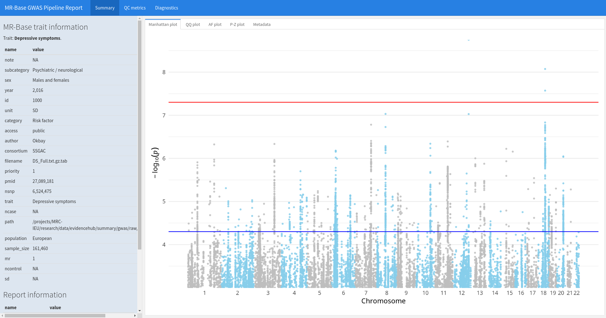
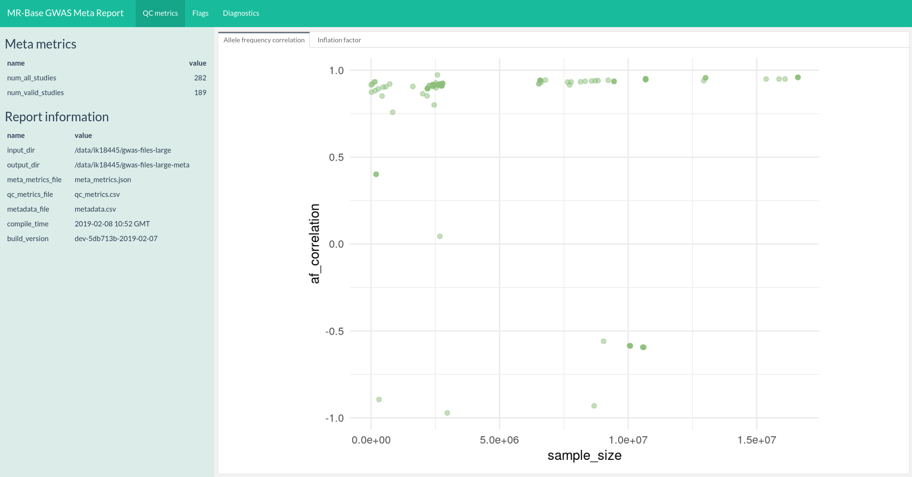

# Report module for IEU GWAS

Pipeline report, metrics, and plots.

A report example is available via RDSF: smb://rdsfcifs.acrc.bris.ac.uk/MRC-IEU-research/projects/IEU2/P4/013/working/data/results/

<p float="centre">
  
  
</p>

**Table of Contents**

- [Report module for IEU GWAS](#report-module-for-ieu-gwas)
- [Local usage](#local-usage)
    - [Setting up environment](#setting-up-environment)
    - [GWAS report](#gwas-report)
        - [Example](#example)
    - [Meta report](#meta-report)
        - [Example](#example-1)
- [Deployment](#deployment)
    - [Setting up environment](#setting-up-environment-1)
    - [GWAS report](#gwas-report-1)


# Local usage

## Setting up environment

- R (>= 3.5), python (>= 3.2), bcftools (1.9), pandoc
- Use [`packrat`](https://rstudio.github.io/packrat/) to bootstrap R environment

## GWAS report

```
$ Rscript render_gwas_report.R --help
usage: render_gwas_report.R [-h] [--refdata REFDATA] [--output_dir OUTPUT_DIR]
                            [--show] [--no_reuse] [--no_render]
                            [--update_qc_metrics]
                            input

Generate report for a GWAS pipeline.

optional arguments:
  -h, --help            show this help message and exit
  --show                If True, show the report after it is generated
                        [default: False]
  --no_reuse            If True, do not reuse any intermediate files [default:
                        False]
  --no_render           If True, only do processing and not rmarkdown report
                        [default: False]
  --update_qc_metrics   If True, reuse intermediate files (if found), and
                        update qc_metrics [default: False]

required arguments:
  input                 Input bcf file, path/to/file [default: gwas-
                        files/2/data.bcf]

Override config.yml:
  --refdata REFDATA     reference bcf data, supply filepath.
  --output_dir OUTPUT_DIR
                        Directory to store outputs, by default is the same to
                        input.
```

### Example

You need

- `input`: `gwas-files/${id}/data.{bcf,bcf.csi}`, where `${id}` is an arbitrary identifier, e.g. 2
- `--refdata`: this defaults to `refdata/1kg_v3_nomult.bcf`

Then run

```
# As an example, replace ${id} with 2
Rscript render_gwas_report.R gwas-files/${id}/data.bcf
```

The report will generate the following under `gwas-files/${id}`

```
.
├── data.bcf             # pre-existed
├── data.bcf.csi         # pre-existed
├── intermediate         # intermediate files
├── metadata.json        # metadata of data.bcf
├── qc_metrics.json      # qc metrics
└── report.html          # the gwas report
```

## Meta report

```
$ Rscript render_meta_report.R --help
usage: render_meta_report.R [-h] [--show] [--no_reuse] input_dir

Generate report for a GWAS pipeline.

optional arguments:
  -h, --help  show this help message and exit
  --show      If True, show the report after it is generated [default: False]
  --no_reuse  If True, do not reuse any intermediate files [default: False]

required arguments:
  input_dir   Input directory that stores all subdirectories

```

### Example

You need

- `input_dir`: The parent directory to a list of sub-directories containing
  files produced by gwas report (with the structure below).

```
.
├── data.bcf
├── data.bcf.csi
├── metadata.json
├── qc_metrics.json
└── report.html
```

Then run

```
# As an example, replace ${input_dir} with ~/gwas-studies
Rscript render_meta_report.R ${input_dir}
```

The report will generate the following under `${input_dir}-meta` (e.g. `~/gwas-studies-meta`)

```{r}
.
├── intermediate                # intermediate files
├── metadata.csv                # aggregated metadata of all studies
├── meta_metrics.json           # metadata to all studies
├── meta_report.html            # the meta report
└── qc_metrics.csv              # aggregated qc metrics of all studies
```

# Deployment

## Setting up environment

Use `docker-compose` and

```
# To avoid generating files as root
UID=$(id -u):$(id -g) docker-compose up
```

Or alternatively, use docker

```
docker build -t mrbase-report -f env/Dockerfile .
docker run --name mrbase-report \
  -v gwas-files:/home/mrbase-report/gwas-files \
  -v ref_data:/home/mrbase-report/ref_data \
  -v logs:/home/mrbase-report/logs \
  -u $(id -u):$(id -g) \
  mrbase-report
```

## GWAS report

Place studies sub-directories under `gwas-files`, and place refdata under `ref_data`. Then run

```
# input=gwas-files/2/data.bcf
# refdata=ref_data/1kg_v3_nomult.bcf
docker exec mrbase-report render_gwas_report.R ${input} --refdata ${refdata}
```
