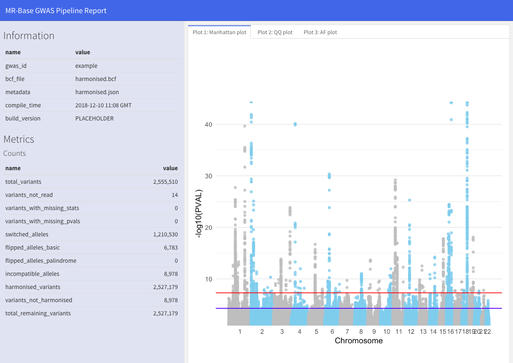

# Report module for MR-Base

Pipeline report, metrics, and plots.

A report example is available via RDSF: smb://rdsfcifs.acrc.bris.ac.uk/MRC-IEU-research/projects/IEU2/P4/013/working/data/results/



# Usage

```
 $ Rscript render_gwas_report.R --help
usage: render_gwas_report.R [-h] [--gwas_id GWAS_ID] [--input INPUT]
                            [--metadata METADATA] [--refdata REFDATA] [-s]
                            [-p]

Generate report for a GWAS pipeline.

Populate the following file structure and specify required args:

.
├── gwas-files
│   └── ${gwas_id}
│       ├── harmonised.bcf
│       ├── harmonised.bcf.csi
│       └── harmonised.json

optional arguments:
  -h, --help           show this help message and exit
  -s, --show           If True, show the report after it is generated
                       [default: False]
  -p, --no_reuse       If True, do not reuse any intermediate files [default:
                       False]

required named arguments:
  --gwas_id GWAS_ID    Directory with the associated gwas_id [default: 2]
  --input INPUT        Input bcf file, supply base filename [default:
                       harmonised.bcf]
  --metadata METADATA  metadata json file: [default harmonised.json]
  --refdata REFDATA    reference bcf file, supply filepath.
```

## A dummy example:

Suppose we have a GWAS QC job with the following specifications:
- A `gwas_id` of `2` as the ID of this job
- the harmonised bcf files named `harmonised.bcf` and `harmonised.bcf.csi`
- the metadata file named as `harmonised.json`
- the reference dataset (to compute allele frequency plot, etc)
  as `path/to/refdata` (subject to change)

Firstly population a directory structure to `./gwas-files`:

>     .
>     ├── gwas-files
>     │   └── 2
>     │       ├── harmonised.bcf
>     │       ├── harmonised.bcf.csi
>     │       └── harmonised.json

Build the report for this QC run as

```
$ Rscript render_gwas_report.R \
  --gwas_id 2 \
  --input harmonised.bcf \
  --metadata harmonised.json \
  --refdata path/to/refdata
```

If the build is successful, the report will be generated as
`./gwas-files/${gwas_id}/report_${gwas_id}_${input}.html`:

>     .
>     ├── gwas-files
>     │   └── 2
>     │       ├── harmonised.bcf
>     │       ├── harmonised.bcf.csi
>     │       ├── harmonised.json
>     │       ├── intermediate
>     │       │   ├── report_query_combined.tsv
>     │       │   └── rmd_intermediate_files
>     │       └── report_2_harmonised.html
